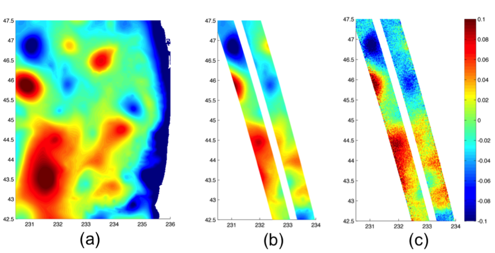
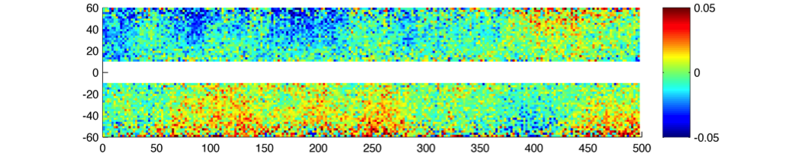
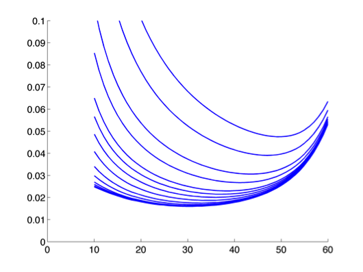
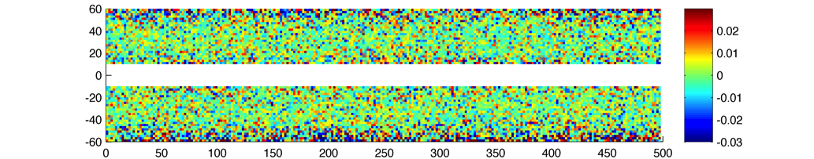
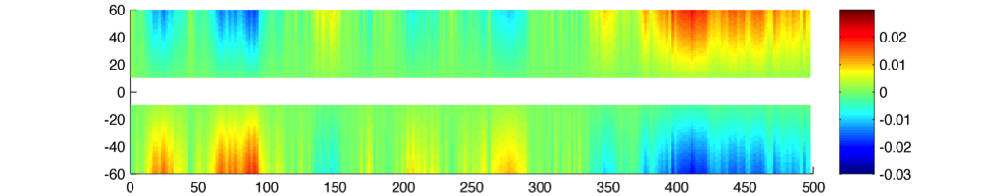
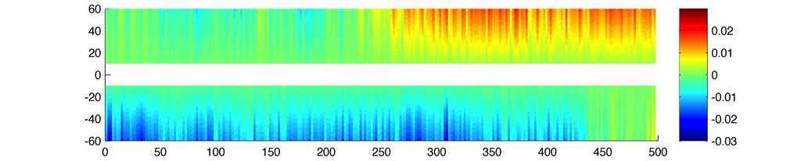
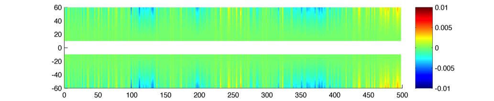
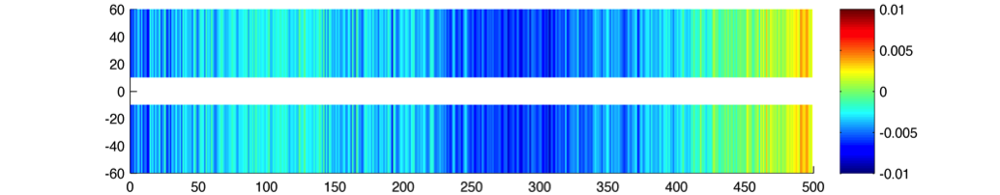

.. _science:
################################
SWOT Simulator for Ocean Science
################################
Clement Ubelmann, Lucile Gaultier and Lee-Lueng Fu

Jet Propulsion Laboratory, California Institute of Technology

.. role:: red
.. toctree::
   :maxdepth: 2
   :numbered:

Abstract:
=========
This software simulates sea surface height (SSH) synthetic observations of the proposed SWOT mission that can be applied to an ocean general circulation model (OGCM), allowing the exploration of ideas and methods to optimize information retrieval from the SWOT Mission in the future. From OGCM SSH inputs, the software generates SWOT-like outputs on a swath along the orbit ground track, as well as outputs from a nadir altimeter. Some measurement error and noise are generated according to technical characteristics published by the SWOT project team. Not designed to directly simulate the payload instrument performance, this SWOT simulator aims at providing statistically realistic outputs for the science community with a simple software package released as an open source in Python. The software is scalable and designed to support future evolution of orbital parameters, error budget estimates from the project team and suggestions from the science community.


Simulation of the SWOT sampling over synthetic Sea Surface Height
=================================================================
From a global or regional OGCM configuration, the software generates SSH on a 120~km wide swath at typically 1~km resolution. An illustration of outputs for a global ECCO (MITgcm) configuration is shown on :ref:`Fig. 1 <Fig1>`.

.. _Fig1:

.. figure:: ../images/Fig1.png 
   :alt: Science SWOT orbit

   FIG. 1: 5-day worth of SWOT simulated data in a global configuration with the science orbit.

.. _ProposedSWOTorbits:

Proposed SWOT orbits
---------------------
The software uses as an input the ground-tracks of the satellite orbit. The user can choose between different orbits such as the fast sampling orbit (1-day repeat), the science orbit (21-day repeat with a 10-day subcycle) and also the contingency orbit (21-day repeat with 1-day subcycle). The table below shows the characteristics of these 3 orbits:

+---------------------+--------------+--------------+------------+-------------+-----------+
|                     | Repeat Cycle | Repeat Cycle | Sub-cycles | Inclination | Elevation |
|                     | (days)       | (Orbits)     | (days)     |             | (km)      |
+=====================+==============+==============+============+=============+===========+
| Fast Sampling orbit | 0.99349      | 14           | N.A.       | 77.6        | 857       |
+---------------------+--------------+--------------+------------+-------------+-----------+
| Science Orbit       | 20.8646      | 292          | 1, 10      | 77.6        | 891       |
+---------------------+--------------+--------------+------------+-------------+-----------+
| Contingency orbit   | 20.8639      | 293          | 1          | 77.6        | 874       |
+---------------------+--------------+--------------+------------+-------------+-----------+

The ground-track coordinates corresponding to these orbits are given as input ASCII files of 3 columns (longitude, latitude, time) for one complete cycle sampled at every  ~5~km. The ascending node has been arbitrarily set to zero degree of longitude, but the user can shift the orbit by any value in longitude.

Orbit files have been updated with the one provided by AVISO_ on september 2015 (http://www.aviso.altimetry.fr/en/missions/future-missions/swot/orbit.html). There are two additional orbit files available in the last version of the simulator. Input files are also ASCII with 3 columns (time, longitude, latitude). Orbits are provided at low resolution and are interpolated automatically by the simulator. 'ephem_calval_june2015_ell.txt' contains the updated fast sampling orbit and 'ephem_science_sept2015_ell.txt' the updated science orbit.

Other orbit files of the same format (time, longitude, latitude) can also be used as an input. To avoid distortions in the SWOT grid, we recommend a minimum of 10km sampling between the ground-track points of the orbit.

.. _AVISO: http://www.aviso.altimetry.fr/en/missions/future-missions/swot/orbit.html

The SWOT swath
---------------
From the orbit nadir ground track the software generates a grid covering the SWOT swath over 1 cycle. In the across-swath direction, the grid is defined between 10~km and 60~km off nadir. The grid size is 2 kilometers in the along-track and across-track directions by default, but can be set at any other value (e.g. 500~m or 250~m). The longitude and latitude coordinates are referenced for each grid point, and the time coordinate (between 0 and t_cycle) is referenced in the along-track direction only. A scheme of the SWOT grid is presented on :ref:`Fig. 2 <Fig2>`.
The SWOT grid is stored by pass (e.g. 292 ascending passes and 292 descending passes for the science orbit). A pass is defined by an orbit starting at the lowest latitude for ascending track and at the highest latitude for descending track (+/-77.6 for the considered SWOT orbits). The first pass starts at the first lowest latitude crossing in the input file, meaning that ascending passes are odd numbers and descending passes are even numbers. 

.. _Fig2:

.. figure:: ../images/Fig2.png
   :alt: SWOT grid

   FIG. 2: scheme of the SWOT grid at 2~km resolution.


Interpolation of SSH on the SWOT grid and nadir track
-------------------------------------------------------
The input SSH must be given at regular time step, over any period of time. By default the absolute time of the first time step is zero and corresponds to the beginning of pass 1. The SSH is interpolated on the SWOT grid and nadir track for each pass and successive cycles if the input data exceeds 1 cycle.The nadir track has the same resolution as the SWOT grid in the along-track direction, but it is possible to compute it separately with a different along track resolution. On the SWOT grid, the 2D interpolation is linear in space. No interpolation is performed in time: the SSH on the SWOT grid at a given time corresponds to the SSH of the closest time step. This avoids contaminations of the rapid signals (e.g. internal waves) if they are under-sampled in the model outputs. However, note that locally, sharp transitions of the SSH along the swath may occur if the satellite happens to be over the domain at the time of transition between two time steps. :ref:`Fig. 3a <Fig3>` shows an input SSH as an example. :ref:`Fig 3b <Fig3>` is the interpolated SSH on a 400km long segment of the SWOT grid crossing the domain.

.. _Fig3:



   FIG. 3: (a) SSH (in meters) produced by the Regional Ocean Modeling System (ROMS) off the Oregon coast developed by Dr. Yi Chao and his team. (b) SSH_model simulator output interpolated on the SWOT grid. (c) “Observed” SSH, which is the sum of SSH_model and a random realization of the total SWOT noise with the default parameters of the software. 

Simulation of errors
====================
The software generates random realizations of instrument errors and noise over the interpolated SSH, as well as simulated geophysical errors. These error simulations can be adjusted to match updates of the error budget estimation from the SWOT project team. :ref:`Fig. 4 <Fig4>` shows a realization of a SWOT error field generated by the software. It is the sum of random realizations of multiple error components described in the following. :ref:`Fig. 3c <Fig3>` shows the “observed” SSH when simulated noise is added to the interpolated SSH.

.. _Fig4:



   FIG. 4: Random realization of the error field (in meters). Swath coordinates are in km. 

.. _Instrumentalerrors:


Instrumental errors
--------------------
The following components of instrumental errors are implemented in the software: the KaRIN noise, the roll errors, the phase errors, the baseline dilation errors and the timing errors. Random realizations of the noise and errors are performed following the statistical descriptions of the SWOT error budget document (:ref:`Esteban-Fernandez et al., 2014 <Esteban-Fernandez2014>`). While cross-track calibration algorithms are not finalized, the long-wavelength components of the instrument errors are filtered beyond 2000~km by default in the software (to simulate approximately the residual errors after cross-track calibrations). **The user interested to test algorithms for cross track calibration of instrument error must deactivate the filtering of the long wavelengths.** Error drifts may then be as large as 20 meters at the edges of the swath. 

The KaRIN noise
```````````````
The KaRIN noise is random from cell to cell, defined by a Gaussian zero-centered distribution of standard deviation inversely proportional to the square root of the cell surface. In the simulator, the KaRIN noise varies with the distance to the nadir and the Significant Wave Height (SWH) specified as a constant value between 0 and 8 meters. For a grid cell of :math:`1km^2`, the standard deviation of the KaRIN noise follows the curve shown on :ref:`Fig. 5 <Fig5>` with SWH varying from 0 to 8~m (:ref:`Esteban-Fernandez et al., 2014 <Esteban-Fernandez2014>`). :ref:`Fig. 6 <Fig6>` shows a random realization produced by the software with :math:`1km^2` grid cells and SWH=2~m.

.. _Fig5:



   FIG. 5: The example curves of the standard deviation (cm) of the KaRIN noise as a function of cross-track distance (km).

.. _Fig6:



   FIG. 6: Random realization of the KaRIN noise (m) following the standard deviation shown Fig. 5, with 2~km by 2~km grid cells and a 2~m SWH.

Note that the present version of the simulator only supports a constant value in time and space for SWH. In future versions, we may implement the use of time/space-varying fields of SWH as an input. 

Roll knowledge and control errors
`````````````````````````````````
As detailed in :ref:`Esteban-Fernandez et al., 2014 <Esteban-Fernandez2014>`, the roll error signal is the sum of two components: the roll error knowledge (also called gyro error) and the roll control errors. An estimation of the along-track power spectral density of the two roll angles is given in the input file ‘global_sim_instrument_error.nc’ from the SWOT project. It is represented on :ref:`Fig. 7 <Fig7>`.

.. _Fig7:

.. figure:: ../images/Fig7.png
   :scale: 60%
   :alt: Power spectral density of the roll error

   FIG. 7: Estimation of the power spectral density of the gyro error angle (blue) and the roll control error angle (green).

Following these spectra, random realizations of an along-track roll angle  :math:`\theta_{roll}` (al) are performed with uniform phase distribution. The algorithm of the random realization is described in APPENDIX A. From :math:`\theta_{roll}` (al) in arcsecond unit, the power spectrum of the gyro knowledge error plus the roll control error, the total roll error h_roll (in meters) at a distance ac (in km) from the nadir is given by (see :ref:`Esteban-Fernandez et al., 2014 <Esteban-Fernandez2014>`):

.. math:: 
   h_{roll} (al,ac)=(1+ \frac{H}{Re}) \theta_{roll} (al) \frac{\pi}{648} ac

where H is the altitude of the satellite and Re the earth radius. An example of realization is shown on :ref:`Fig. 8 <Fig8>`.

.. _Fig8:



   FIG. 8: Random realization of the roll error following the power spectra of the roll angle shown Fig. 7 (with filtering of long wavelengths).

Phase errors
````````````
An estimation of the along-track power spectrum of phase error is also given in the input file ‘global_sim_instrument_error.nc’. It is represented on :ref:`Fig. 9 <Fig9>`.

.. _Fig9:

.. figure:: ../images/Fig9.png
   :scale: 60%
   :alt: Power spectral density of the phase error

   FIG. 9: Estimation of the power spectral density of the phase error

Following this power spectrum, random realizations of an along-track phase error :math:`\theta` (al) are performed with uniform phase distribution. From :math:`\theta` (al)  in deg. unit, the phase error on the height :math:`h_{\theta}` (in meters) at a distance ac (in km) from the nadir is given by (see :ref:`Esteban-Fernandez et al., 2014 <Esteban-Fernandez2014>`):

.. math::
   h_{\theta} (al, ac) = \frac{1}{K_{Ka}B}(1+\frac{H}{Re})\theta (al) \frac{100 \pi}{18}ac

An independent realization of :math:`\theta` is chosen for the left (ac<0) and right (ac>0) swaths. As a result, the error is decorrelated between the 2 sides (as opposed to the case of roll error), as illustrated on the random realization shown on :ref:`Fig. 10 <Fig10>`.

.. _Fig10:



   FIG. 10: Random realization of the phase error on height following the power spectra of the phase error shown Fig. 9 (with filtering of long wavelengths).

Baseline dilation errors
````````````````````````
The baseline dilation and its resulting height measurement error is also implemented, although the errors are significantly less important than the roll and phase errors. The along-track power spectrum of the dilation :math:`\delta B` is also given in the input file ‘global_sim_instrument_error.nc’. It is represented on :ref:`Fig. 11 <Fig11>`.

.. _Fig11:

.. figure:: ../images/Fig11.png
   :scale: 60%
   :alt: Power spectral density of the baseline dilation

   FIG. 11: Estimation of the power spectral density of the baseline dilation.

Following this power spectrum, random realizations of an along-track baseline dilation :math:`\delta B` are performed with uniform phase distribution. From :math:`\delta B` in :math:`\mu m`, the baseline dilation error on the height :math:`h_{\delta B}` (in meters) at a distance ac (in km) from the nadir is given by the following formula (see :ref:`Esteban-Fernandez et al., 2014 <Esteban-Fernandez2014>`):

.. math::
   h_{\delta B} (al, ac) = -(1+\frac{H}{Re})\frac{\delta B(al)}{HB}ac^2



   FIG. 12: Random realization of the baseline dilation error on height following the power spectra of the baseline dilation shown Fig. 11 (with filtering of long wavelengths).

Timing errors
`````````````
The timing errors are also minor compared to roll and phase errors, but are implemented in the software. The along-track power spectrum of the timing error :math:`\tau` is also given in the input file ‘global_sim_instrument_error.nc’. It is represented on :ref:`Fig. 13 <Fig13>`.

.. _Fig13:

.. figure:: ../images/Fig13.png
   :scale: 60%
   :alt: Power spectral density of the timing error

   FIG. 13: Estimation of the power spectral density of the timing error

Following this power spectrum, random realizations of an along-track timing error :math:`\tau` are performed with uniform phase distribution. From :math:`\tau` (al) in *pico seconds*, the timing error on the height :math:`h_\tau` (in meters) at a distance ac (in km) from the nadir is given by (see :ref:`Esteban-Fernandez et al., 2014 <Esteban-Fernandez2014>`):

.. math:: 
   h_\tau (al,ac)=\frac{c}{2} \tau (al) \times 10^{-12}

Where c is the speed of light in m/s. The timing errors are constant in the across swath direction. An example is shown on :ref:`Fig. 14 <Fig14>`.

.. _Fig14:



   FIG. 14: Random realization of timing error on height (in meters) following the power spectra of the timing error shown Fig. 13 (with filtering of long wavelengths).

Geophysical errors
-------------------
So far, only the major geophysical source of error, the wet troposphere error, has been implemented in the software in a quite simple way. More realistic simulation will be hopefully implemented in the future versions.

.. _Wettroposphereerrors:

Wet troposphere errors
``````````````````````
The software simulates errors in the water vapor path delay retrieval with the option of a 1-beam radiometer configuration or a 2-beam radiometer configuration. First, a 2D random signal is generated around the swath following a 1D input spectrum, with uniform phase distribution as described in APPENDIX A. By default in the software, the 1D spectrum is the global average of estimated path delay spectrum from the AMSR-E instrument and from the JPL’s High Altitude MMIC Sounding Radiometer (Brown et al.) for the short wavelength. This spectrum is expressed by the following formula (in cm2/(cy/km)):

.. math::
   S_{wet}=3.156 \times 10^{-5} f^{-8/3} \  for\ 3000km > \lambda > 100km

   S_{wet}=1.4875 \times 10^{-4} f^{-2.33} \  for\ \lambda \leq 100km

:ref:`Fig. 15 <Fig15>` shows a random realization of the path delay following the above spectrum. By modifying the code, the user can change the power spectrum to match the water vapor characteristics of a particular region, by using for example the global climatology provided in :ref:`Ubelmann et al., 2013 <Ubelmannetal2013>`. 

.. _Fig15:

.. figure:: ../images/Fig15.png
   :alt: Random realization of wet-tropospheric path delay

   FIG. 15: Random realization of wet-tropospheric path delay without correction (in meters).

From the 2D random signal, the software simulates the residual error after correction for the estimated path delay from the radiometer. By default, the number of radiometer beams is set to 1. We considered that the radiometer (with 1 or 2 beams) measure the path delay averaged over a 2D Gaussian footprint with standard deviation :math:`\sigma_0` (in km). :math:`\sigma_0` is set at 8~km by default (corresponding to an overall 20~km diameter beam, close to the characteristic of the AMR radiometer on Jason-2), but can be modified by the user since the beam characteristics are not yet fixed by the project team. An additional radiometer instrument error is considered, given by the following characteristics (in cm2/(cy/km , see :ref:`Esteban-Fernandez et al., 2014 <Esteban-Fernandez2014>`):

.. math::
   S_{wet\_instr}=9.5×10^{-5} f^{-1.79} \  for\ 10^{-3} \leq f < 0.0023

   S_{wet\_instr}=0.036f^{-0.814} \  for\ 0.0023 \leq f < 0.0683

   S_{wet\_instr}=0.32\  for\ f \geq 0.0683

The high frequencies of instrument error (below 25km wavelength) have been filtered in the simulator. Indeed, this high-frequency signal can be easily removed since it exceeds significantly the spectral characteristics of a water vapor spectrum averaged over a 25~km diameter beam.
The scheme on :ref:`Fig. 16 <Fig16>` shows how the residual error with a 1-beam or 2-beam radiometer is calculated. In the 1-beam case, the single beam measurement around the nadir plus a random realization of the radiometer instrument error is the estimate applied across the swath. In the 2-beam case, the estimation across the swath is a linear fit between the two measurements. :ref:`Fig. 17 <Fig17>` shows an example of residual error after a 1-beam and a 2-beam correction.

.. _Fig16:

.. figure:: ../images/Fig16.png
   :alt: Simulation of path delay estimation and the residual error

   FIG. 16: Scheme showing the simulation of the path delay estimation and the residual error for a 1-beam (left) and 2-beam (right) radiometer configuration.

.. _Fig17:

.. figure:: ../images/Fig17.png
   :alt: Residual error after wet-tropospheric correction using a 2-beam or 1-beam radiometer

   FIG. 17: (a) Residual error after wet-tropospheric correction with the simulation of a 2-beam radiometer at 35~km away from nadir, from the simulated path delay on Fig. 15. (b) Residual error with the simulation of a 1-beam radiometer at nadir. 


Sea state bias
```````````````
The Sea State Bias (or Electromagnetic bias) and its estimation are not implemented in the software yet. In later versions, inputs of SWH and surface wind speed may be proposed to simulate SSB and the residual error after SSB estimation. 

Other geophysical errors
`````````````````````````
The other geophysical errors (Dry-troposphere, Ionosphere) are not implemented in the software since they have a minor impact on the mesoscales to be observed by SWOT. 

.. raw:: latex

    \newpage

Total error budget
-------------------
The along-track power spectra of the different error components have been computed to check the consistency with the baseline requirements. These spectra, averaged across-track between 10~km and 60~km off nadir, are represented on :ref:`Fig. 18 <Fig18>`. The total error budget with a 1-beam radiometer (thick black curve) is indeed slightly below the error requirement (thick red curve).

Note that the along-track power spectrum of the KaRIN noise (dark pink thick curve) sampled on a 2~km by 2~km grid is about 6 :math:`cm**2/(km/cy)`, which exceeds the requirements for short wavelength. However, these requirements have been defined for wavelength exceeding 15~km in the plan (2 dimensions). Sampled at the Niquist frequency in the across swath direction (7.5~km), the noise drops down to 2 :math:`cm2/(km/cy)` (thick dark pink curve).      

.. _Fig18:

.. figure:: ../images/Fig18.png
   :alt: Error budget in the spectral domain 

   FIG. 18: Error budget in the spectral domain, computed from a random realization of the simulator. The spectral densities have been averaged across-swath between 10~km and 60~km off nadir, consistenly with the definition of the requirements. 

Simulation of errors for the nadir altimeter
============================================
Two main components of the nadir altimetry error budget are simulated : the altimeter noise and residual wet-tropo errors. For the altimeter noise, the noise follow a spectrum of error consistent with global estimates from the Jason-2 altimeter. The wet tropo residual errors are generated using the simulated wet tropo signal and radiometer beam convolution described above for the KaRIN data.

.. raw:: latex

    \newpage

The software
=============
The software is written in Python, and uses Numpy and Scipy python libraries. All the parameters that can be modified by the user are read in a params file (e.g. params.txt) specified by the user. These parameters are written in :ref:`yellow <params>` later on and are linked to their location in the params file example. 

The software is divided in 6 modules: 

* :mod:`run_simulator.py` is the main program that runs the simulator.

* :mod:`build_swath.py` generates the SWOT swath and save several swath variables in a netcdf file.

* :mod:`build_error.py` generates all the errors on the swath.

* :mod:`rw_data.py` contains all the classes to read and write model and SWOT swath data (in netcdf).

* :mod:`mod_tools.py` contains miscellaneous functions (algebraic functions and generation of random coefficients).

* :mod:`run_nadir.py` enables the user to run the nadir alone.

As of version 3.1, the simulator can run on several processor, just add the options `proc_number = [your number of processor] <params-file>` in your parameter file. Please note that data will be duplicated in each processor and thus can take a large amount of your RAM.
 
Inputs
-------
The inputs are SSH model outputs in netcdf (to read netcdf4 files, the python module netCDF4 is needed). Each time step is stored in one file so that there are as many files as time steps. A list of file (in .txt format)  is read by the software. It contains the grid file and all SSH model outputs. The first file in this list is the grid, therefore, if the grid is contained in the SSH files, the first SSH file should be repeated. The directory that contains input (:ref:`indatadir <params-file>`) and the name of the list of files (:ref:`file_input <params-file>`) are specified in the params file. 

.. code-block:: python

   Grid_model 
   SSHmodel_0001
   SSHmodel_0002
   SSHmodel_0003

FIG 19: Example of a list of files, a real example is located in the example directory.

It is possible to generate the noise alone, without using any SSH model as an input. To generate the noise alone, the name of the list of files  (:ref:`file_input <params-file>`) should be set to `None`. 

The module :mod:`rw_data.py` is used to read model data. For any standard netcdf format, the data can be read using :ref:`model <params-model>` =MODEL_NETCDF, which is the :ref:`model<params-model>` default value. The user needs to specify the latitude (:ref:`lat <params-model>`), longitude (:ref:`lon <params-model>`), and SSH(:ref:`var <params-model>`) variable names. Netcdf data that follow NEMO or ROMS format can automatically be read using :ref:`model <params-model>` =NEMO or :ref:`model <params-model>` =ROMS and there is no need to specify the longitude, latitude or SSH variables name. The coordinates are supposed to be in degrees and SSH variable in m in the program, if the SSH is not in m, specify the conversion factor in :ref:`SSH_factor <params-model>` (so that SSH*SSH_factor is in m). The time step between two inputs (:ref:`timestep <params-model>`) and the number of steps that have to be processed (nstep) can be modified in the params file. The value corresponding to not a number can be specified in :ref:`model_nan <params-model>`.
 
Generation of the SWOT grid
----------------------------
The SWOT grid is generated in the :mod:`build_swath.py` module. The orbit file (:ref:`filesat <params-file>`) is located in :ref:`dir_setup <params-file>` and contains longitude, latitude and the corresponding time for each point of the orbit (see section :ref:`ProposedSWOTorbits` for more details on the provided orbit). The orbit is interpolated at the along track resolution specified by the user (in :ref:`delta_al <params-swotswath>`) and the swath is computed at each points of the orbit with an across track resolution specified by the user (in :ref:`delta_ac <params-swotswath>`). The width of the swath (:ref:`halfswath <params-swotswath>`) and the gap between the nadir and the swath (:ref:`halfgap <params-swotswath>`) can also be defined according to :ref:`Fig. 2 <Fig2>`. The generation of the SWOT grid can be made on the whole region of the model (:ref:`modelbox <params-swotswath>` =None) or on a subdomain (:ref:`modelbox <params-swotswath>` =[lon_min, lon_max, lat_min, lat_max]). To compute the noise alone (:ref:`file_input=None <params-file>`), a :ref:`modelbox <params-swotswath>` has to be provided. If there is no pass on the required domain, the user can specify a shift in longitude (:ref:`shift_lon <params-swotswath>`).

A netcdf file containing SWOT grid information is stored for each pass in the output directory (:ref:`outdatadir <params-file>`) under the name :ref:`filesgrid <params-swotswath>` _p[pass].nc. It contains along track distances (x_al) from the first point of the orbit and across track distances (x_ac) from the nadir (in km), longitudes (lon) and latitudes (lat) at each point of the SWOT grid, the number of days in a cycle (cycle) and the distance crossed by the satellite in a cycle (al_cycle). Once the SWOT grid has been created, it is stored in :ref:`outdatadir <params-file>`. As long as the domain (:ref:`modelbox <params-swotswath>` parameter) does not change, the grid does not have to be recomputed and :ref:`makesgrid <params-swotswath>` can be set to False. 
The nadir grid is stored separately under the name :ref:`filesgrid <params-swotswath>` nadir_p[pass].nc.
For a more convenient use, in the example the name of the output files are a concatenation of a :ref:`config <params-swotswath>` name and `satname <params-file>` orbit name.

Sampled SSH and error fields
----------------------------
At each pass, for each cycle, an output netcdf file containing the SSH interpolated from the model (if :ref:`file_input <params-file>` is set to `None`) and the different errors are created. The output file names are :ref:`file_output <params-output>` _c[cycle]_p[pass].nc for the swath and :ref:`file_output <params-output>` nadir_c[cycle]_p[pass].nc for the nadir. The SSH is interpolated at the SWOT grid resolution. If the model grid is regular, option :ref:`grid <param-file>` can bet set to `regular` and RectBivariateSpline interpolation from scipy is used. In all cases, :ref:`grid <param-file>` option can be set to `irregular` and pyresample is used for the interpolation if the module is installed. If the grid is irregular and pyresample is not installed, griddata from scipy interpolates data using either the 'linear' (:ref:`interpolation <params-output>` ='linear') or 'nearest' neighbor (:ref:`interpolation <params-output>` ='nearest'). In case of large domain, this last solution for the interpolation can be slow and even trigger memory error. The use of the ‘nearest’ interpolation is necessary to avoid memory error though the gradient of the SSH is significantly altered using this interpolation method. 

To compute each error, set the corresponding parameter to True (:ref:`karin <params-error>`, :ref:`roll <params-error>`, :ref:`baseline_dilation <params-error>`, :ref:`phase  <params-error>`, :ref:`timing  <params-error>`, :ref:`wet_tropo <params-error>`, :ref:`ssb  <params-error>`). 
The KaRIN noise levels are read in karin_file, and are a function of the Significant Wave Height (SWH) and of the across track distance to the nadir. The SWH can be defined in :ref:`swh <params-error>` (in m). Note that all :ref:`swh <params-error>` greater than 8.0~m are set to 8.0~m. The KaRIN noise is randomly computed using coefficients produced on a :ref:`nrandkarin  <params-error>` km long grid (suggested value is :ref:`nrandkarin  <params-error>` =1000~km). Note that two files are actually provided for the KaRIN noise, the old one karin_noise_v1.nc for those who need consistency with older run, and the new one karin_noise_v2.nc which contains more levels of noise and the noise is defined up to 5~km from the nadir (vs 10 for the old file). By default the simulator takes the newest file to compute KaRIN noise. 
As explained in section :ref:`Instrumentalerrors`, the instrumental errors (roll, baseline_dilation, phase, timing) are randomly computed according to a spectrum specified in the file :ref:`file_inst_error  <params-error>`. A cut-off wavelength (:ref:`lambda_cut <params-error>`) of 40000~km  is recommended in model studies so that only errors below the cut-off wavelength are represented, however :ref:`lambda_cut <params-error>` should be set to None for cross-calibration studies (see section 2.1). The number of random coefficients is specified in :ref:`ncomp1d <params-error>` for 1d spectrum and (:ref:`ncomp1d <params-error>` =2000 is recommended) and :ref:`ncomp2d <params-error>` for 2d spectrum (mainly the wet_tropo error, :ref:`ncomp2d <params-error>` =2000 is recommended). Having different numbers of random coefficients for 1d and 2d spectrum enables to reduce the computing cost when one needs a high number of random cofficients for the instrument error (only 1d spectrum). The computation of the wet_tropo error is costly so that one needs to keep the number of random coefficients for 2d spectrum as small as possible.  Several parameters can be modified to compute the residual wet_tropo error. Following the subsection :ref:`Wettroposphereerrors`, the residual path delay error can be computed using one beam (:ref:`nbeam  <params-error>` =1), two beams (:ref:`nbeam  <params-error>` =2), or both of these residual path delay error can be computed (:ref:`nbeam  <params-error>` = 'both'). Each beam has a Gaussian footprint of :ref:`sigma  <params-error>` km. If there are two beams, the left beam is located at :ref:`beam_pos_l  <params-error>` km from the nadir and the right one at :ref:`beam_pos_r  <params-error>` km from the nadir. If only one beam is used, it is located at the nadir. As for the Sea State bias error (:ref:`ssb  <params-error>`), it has not been implemented yet. 
To avoid repeating the random coefficients if the simulator is runned on large scale, a function has been written to compute the random signal. To activate it, set :ref:`savesignal = True <params-error>`. Then specify the number of peudo-period of superimposed signals :ref:`npseudoper <params-error>` and the repeat length of the signal.

WARNING: The option savesignal = True does not enable reproducible runs as the signal is not saved in file (just in the memory while the program is running). Remember to set file_coeff = None.
:ref:`ncomp1d <params-error>` and :ref:`ncomp2d <params-error>` are not used if :ref:`savesignal` is set to `True`.

All the computed errors are saved in the output netcdf file. The observed SSH (SSH_obs) is also computed by adding all the computed errors to the SSH from the model (SSH_model) when model data are provided. Note that if :ref:`nbeam  <params-error>` ='both' (residual error due to path delay using one beam and two beams are both computed), only the residual error due to path delay using one beam is considered in the observed SSH. 

Two errors are considered in the nadir. The first one is the instrument error, which follows the 1d spectrum computed from the current altimeters. You have to set (:ref:`nadir <params-error>`) to True to compute this error. The second error is the path delay due to the wet troposphere and this error is computed with the residual path delay error in the swath. The observed SSH (SSH_obs) is computing by adding these two errors to the SSH interpolated from the model (SSH_model). 

Reproducible runs
-----------------
It is possible to reproduce the exact same run by saving the random coefficients (phase phi, amplitude A and frequency fr) for every error but the KaRIN noise. Random coefficients on a :ref:`nrandkarin  <params-error>` km long and :ref:`x_ac <params-swotswath>` km large are saved for KaRIN noise. All these variables are saved during the first run in :ref:`file_coeff  <params-error>`. The random coefficients for the nadir are store in a separate file :ref:`file_coeff <params-error>` _nadir.nc. If you don’t want the runs to be reproducible, set :ref:`file_coeff <params-error>` =None.
WARNING: Note that you can't run reproducible runs (file_coef = yourfiles) and have a better randomness in large scale noise (savesignal=True) as no coefficient files are generated while this last option is enabled.

Warning: If the size of the across track grid (:ref:`x_ac <params-swotswath>`) or the numbers of random coefficient (:ref:`ncomp <params-error>`, :ref:`nrandkarin <params-error>`) are changed, the random coefficients must be recomputed as their shape has been modified.  

Simulate nadir data alone
--------------------------
When the simulator is run, the altimeter is simulated at the nadir but with the same along track resolution as the one in SWOT swath. It is possible to compute the altimeter data alone so that the along track resolution is independant of the simulator, or to compute Observation-like observation from any altimeter. To do so, run : ``>>run_nadiralone.py [your params file]``
This run uses the module run_nadir.py, which simulates the nadir along track data at a resolution of :ref:`delta_al <params-swotswath>` that can be specified in the nadir params file. This parameter file is very similar to the one used for SWOT simulator. See the ``params_example_nadir.txt`` txt in the example directory for an example. The only difference between the swot simulator parameter file and the nadir alone parameter file is that a list of orbit file can be provided in :ref:`filesat <params-file>` instead of a single file, enabling the user to simulate several altimeters.  


Getting started 
----------------
All information regarding the installation and running of the software are in the :ref:`README` file. An example of a :ref:`parms.txt <params>` file is given below. A ready to launch kit is also provided in ``swotsimulator/example/``. It contains model files produced by the Regional Ocean Modeling System (ROMS) off the Oregon coast developed by Dr. Yi Chao and his team (stored in ``swotsimulator/example/input_fields/``) and a params file (``params_example.txt``). To test the Simulator using the provided example, install python and the simulator as it is advised in the :ref:`README` file, modify ``dir_setup``, ``indatadir``, ``outdatadir`` with your own path in ``swotsimulator/example/params_example.txt``. The outputs of the example are going to be saved in ``outdatadir = swotsimulator/example/swot_output/``.

To print help regarding the simulator or one of the modules, type in a python or ipython window:

.. code-block:: python

   >>>import swotsimulator.M
   >>>help(swotsimulator.M)

with M the name of the module. 

To run the example, type in any terminal:

.. code-block:: python

   >> swotsimulator ./example/params_example.py

for the SWOT simulator and

.. code-block:: python

   >> nadirsimulator ./example/params_example_nadir.py

to compute the nadir alone. 

Note that if no params file is provided, the default one is ``./example/params_example.txt``.

.. _params:

Example of Params.txt for SWOT-like data
``````````````````````````````````````````

.. _params-file:

.. literalinclude:: params.py
   :lines: 1-20

.. _params-swotswath:

.. literalinclude:: params.py
   :lines: 22-49

.. _params-model:

.. literalinclude:: params.py
   :lines: 51-78

.. _params-output:

.. literalinclude:: params.py
   :lines: 80-94

.. _params-error:

.. literalinclude:: params.py
   :lines: 97-

Example of Params.txt for nadir-like data
``````````````````````````````````````````

.. _params-file-nadir:

.. literalinclude:: params-nadir.py
   :lines: 1-15

.. _params-nadirtrack:

.. literalinclude:: params-nadir.py
   :lines: 17-42

.. _params-model-nadir:

.. literalinclude:: params-nadir.py
   :lines: 44-71

.. _params-output-nadir:

.. literalinclude:: params-nadir.py
   :lines: 73-84

.. _params-error-nadir:

.. literalinclude:: params-nadir.py
   :lines: 86-

References:
===========
.. _Esteban-Fernandez2014:

Esteban-Fernandez, D. SWOT Project Mission Performance and error budget” document, 2014 (JPL D-79084)


.. _Ubelmannetal2013:

Ubelmann, C., Fu, L-L., Brown, S. Peral, E. and Esteban-Fernandez, D. 2014: The Effect of Atmospheric Water Vapor Content on the Performance of Future Wide-Swath Ocean Altimetry Measurement. J. Atmos. Oceanic Technol., 31, 1446–1454.

Gaultier, L., C. Ubelmann, and L-L. Fu, 2016: The challenge of using future SWOT data for oceanic field reconstruction, J. Ocean. Atm. Tech., 33, 119-126, DOI: 10.1175/JTECH-D-15-0160.1

